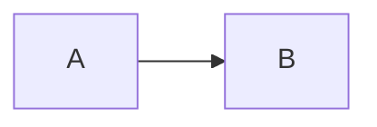
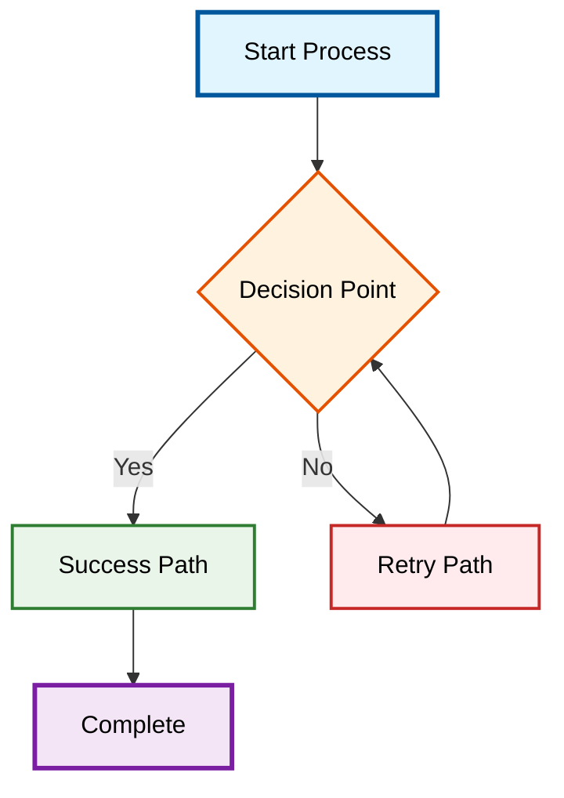

# 🎨 Example Page

Welcome to the **{{ metadata.project.name }}**! This example page demonstrates various features:

## Mermaid Diagram

Below is a Mermaid diagram with custom colorization:



---



## Using Variables

Here are some project details sourced from `.metadata.yaml`:

- **Version**: `{{ metadata.version }}` - {{ metadata.version_name }}
- **Release Date**: {{ metadata.release_date }}
- **Project Name**: {{ metadata.project.name }}
- **Description**: {{ metadata.project.description }}

## Markdown Features

- **Bold Text**: Double asterisks `**bold**`
- **Italic Text**: Single asterisks `*italic*`
- **Links**: [Project Repository]({{ metadata.project.repository }})

### Lists

- Item 1
  - Sub-item 1.1
  - Sub-item 1.2
- Item 2

### Code Block

```python
# Sample Python Code
print("Hello, world!")
```

For more information, visit the [Documentation Site]({{ metadata.project.documentation }}).

