# Mermaid Demonstration

This document demonstrates various types of diagrams that can be created using Mermaid.

## Chapter 1: Flowchart

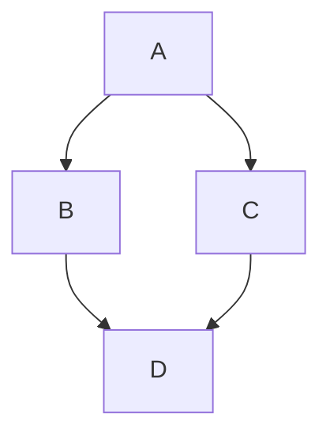

## Chapter 2: Sequence Diagram

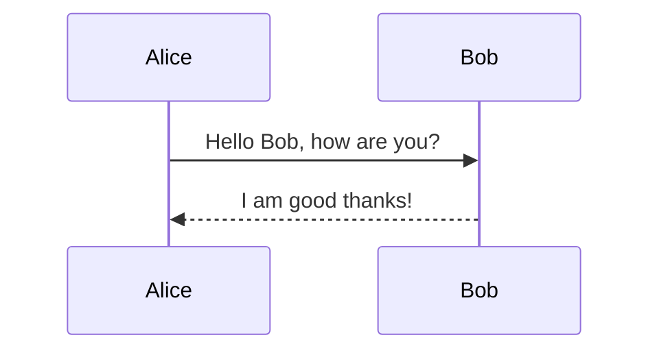

## Chapter 3: Class Diagram

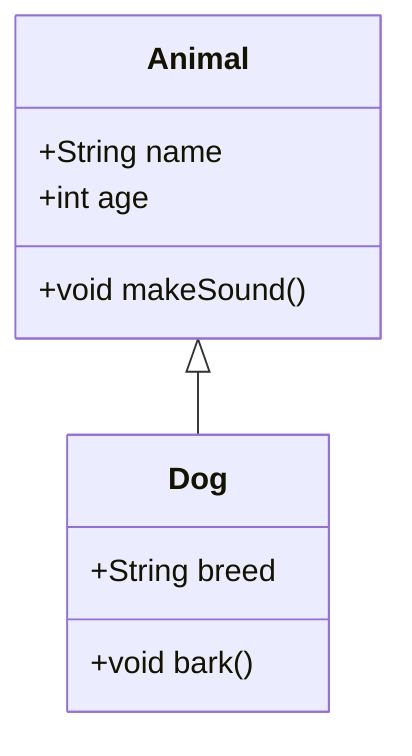

## Chapter 4: State Diagram

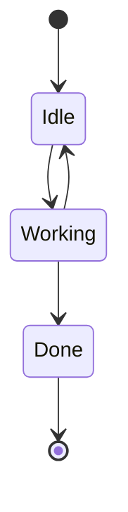

## Chapter 5: Pie Chart

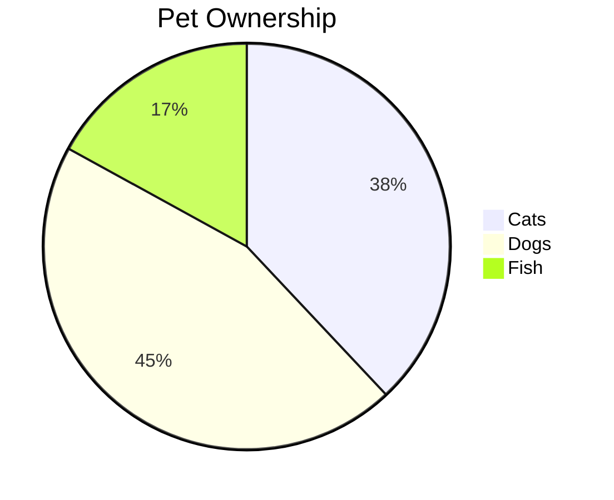

## Chapter 6: Gantt Chart

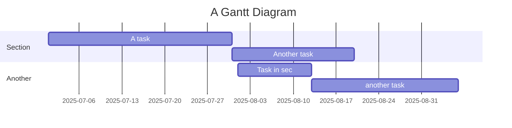

## Chapter 7: Journey

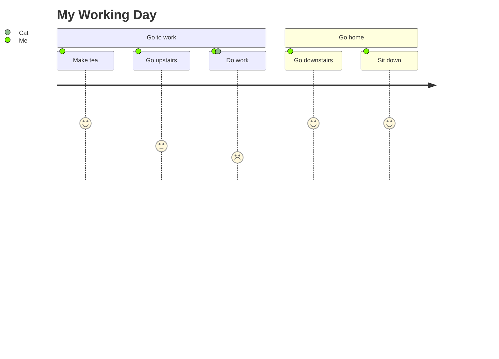

## Chapter 8: Graph

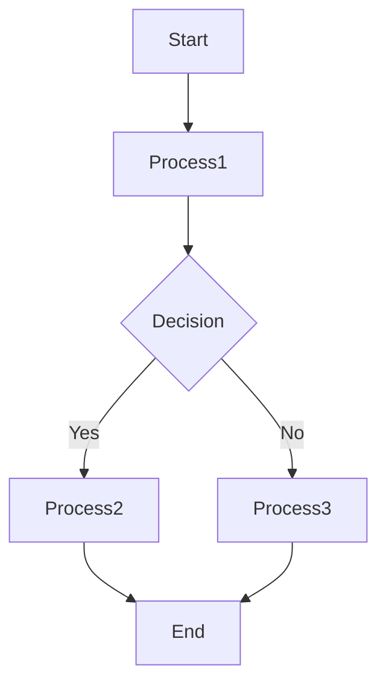

## Chapter 9: Quadrant Chart

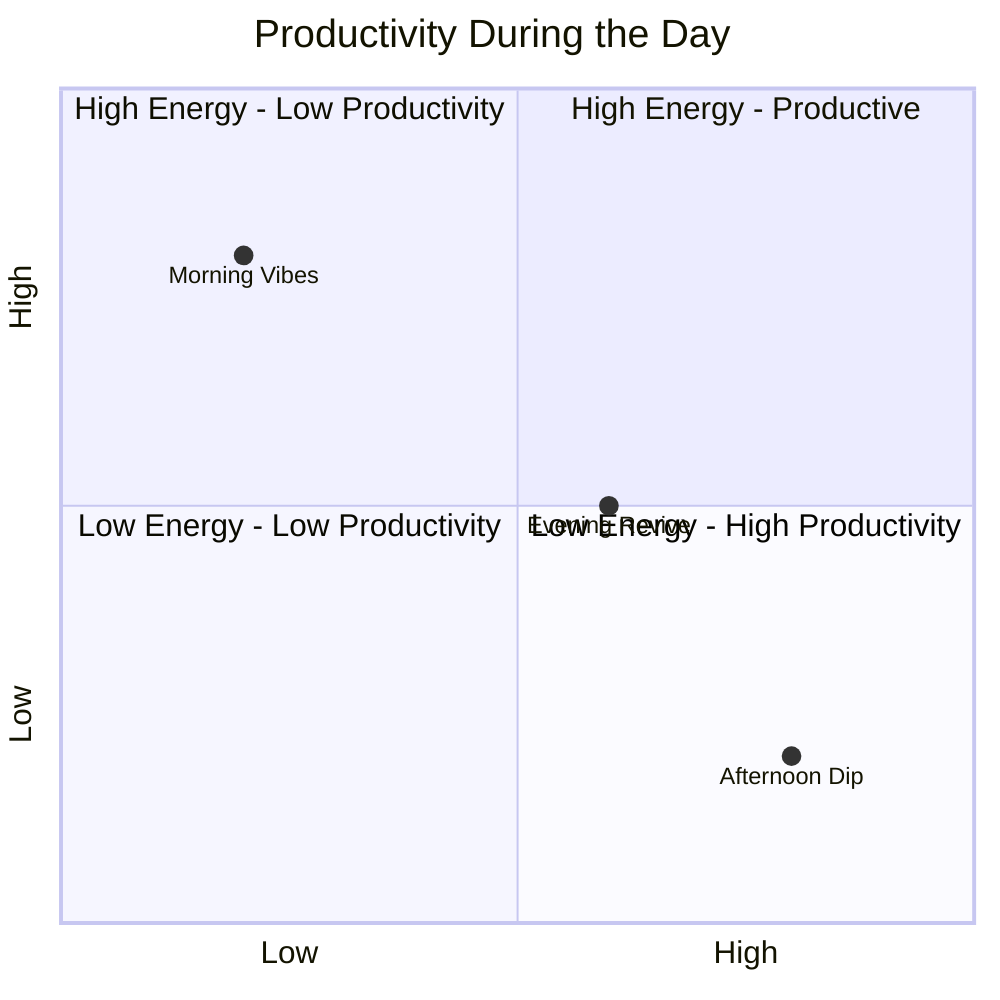

## Chapter 10: XY Chart

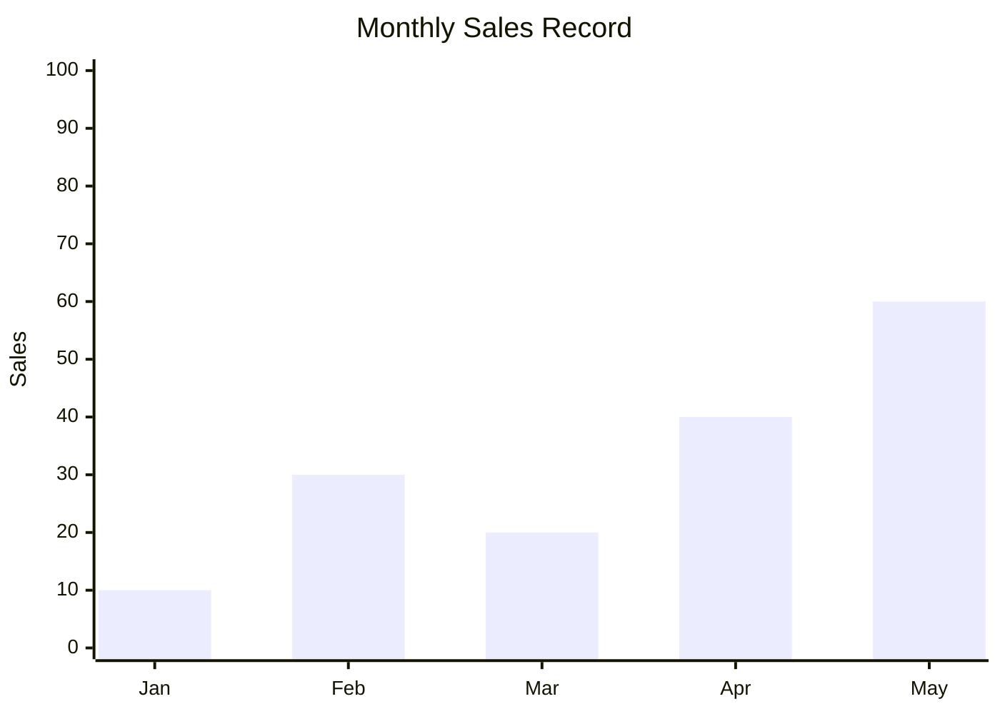

## Chapter 11: Block Diagram

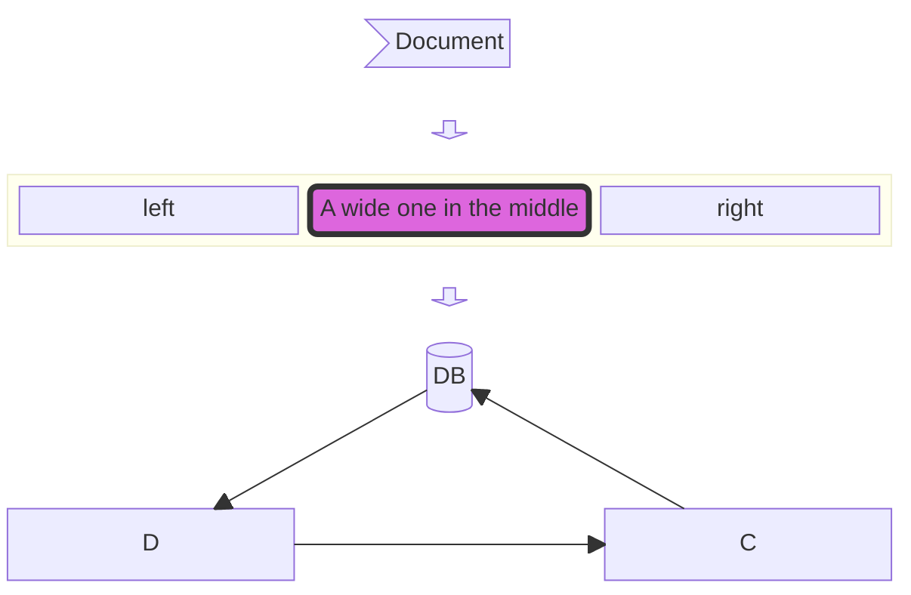

## Chapter 12: Git Graph

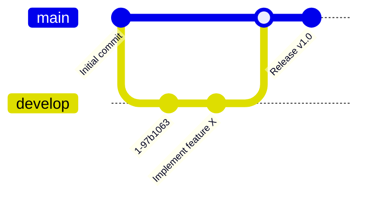

## Chapter 13: Mindmap

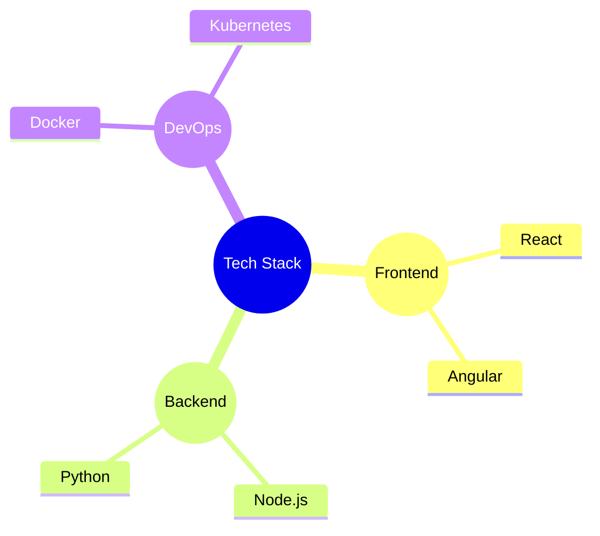

Each of the above chapters provides an example of a different type of diagram that can be created using Mermaid.
