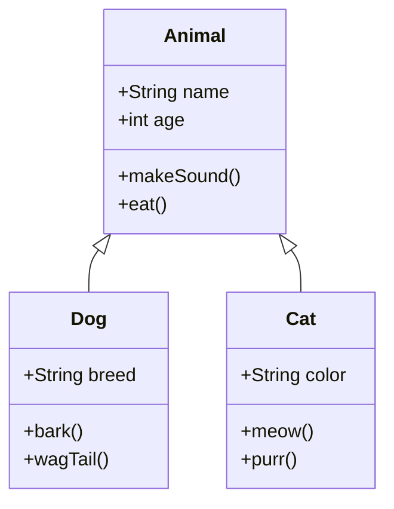
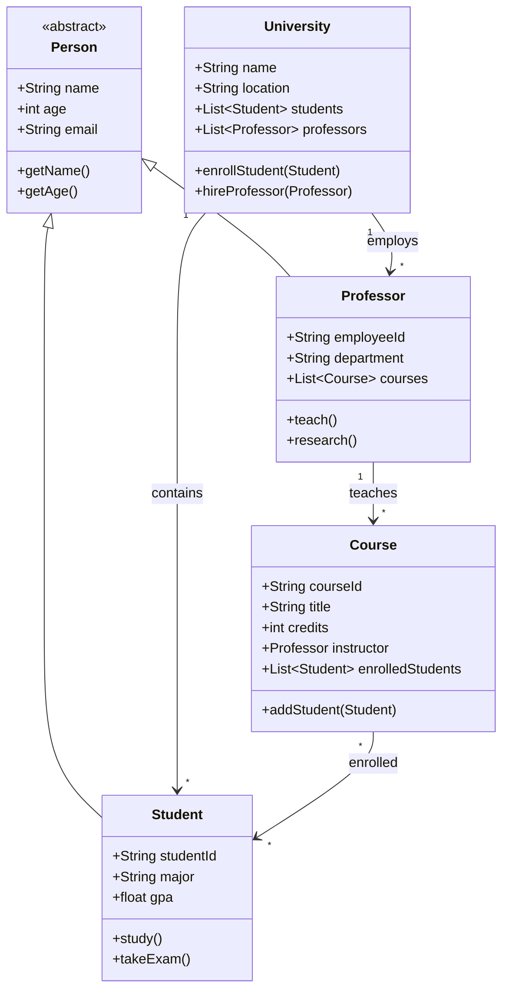
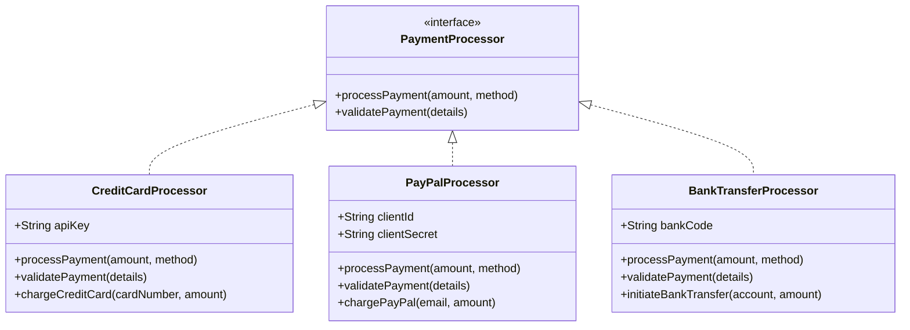

# Class Diagram Examples

This document contains class diagrams for testing the mermaid extraction tools.

## Basic Class Diagram

## University System

## Payment System

These class diagrams demonstrate various object-oriented design patterns that should be extracted by our tools.
