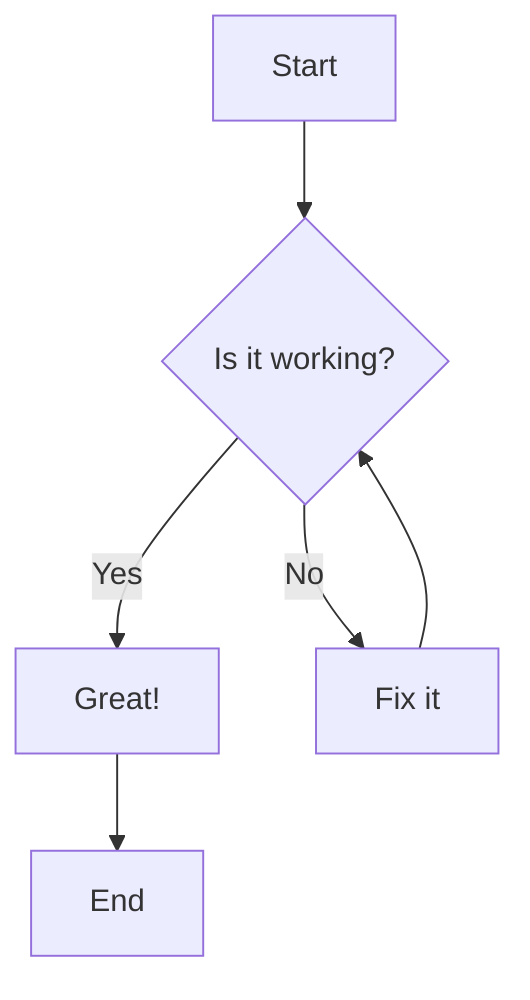
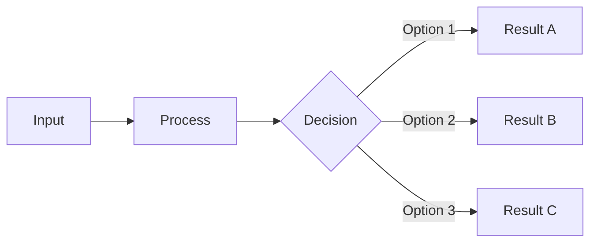
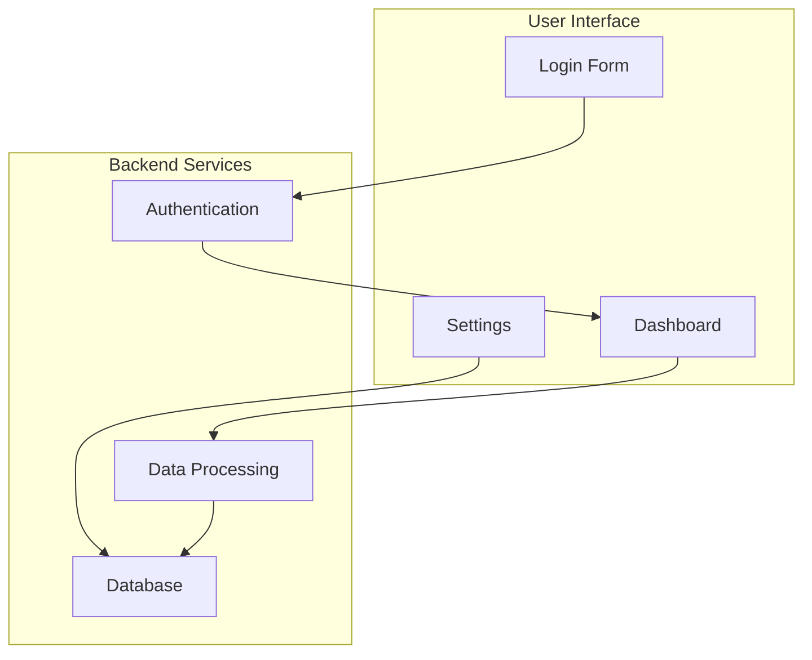

# Sample Flowchart Documentation

This document contains a sample flowchart for testing the mermaid extraction tools.

## Basic Flowchart

## Process Flow

Here's another example of a process flow:

## Subgraph Example

This document demonstrates various types of flowcharts that should be extracted by our tools.
