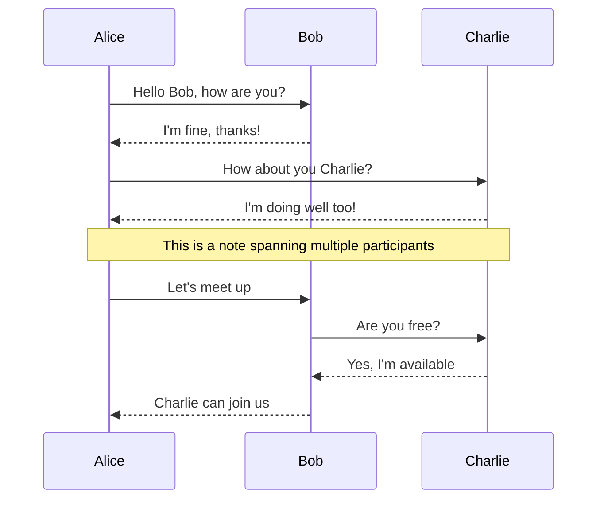
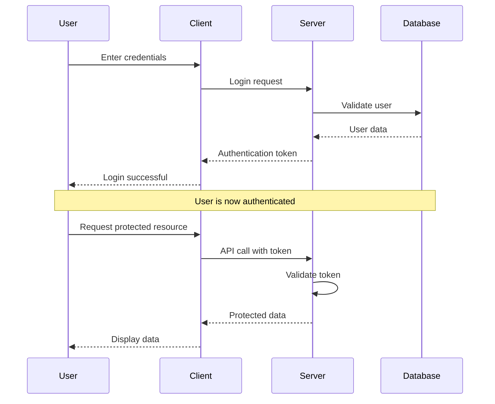
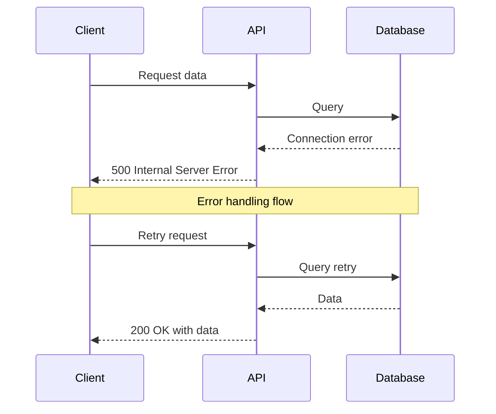

# Sequence Diagram Examples

This document contains sequence diagrams for testing the mermaid extraction tools.

## Basic Sequence Diagram

## Authentication Flow

## Error Handling Sequence

These sequence diagrams demonstrate various communication patterns that should be extracted by our tools.
